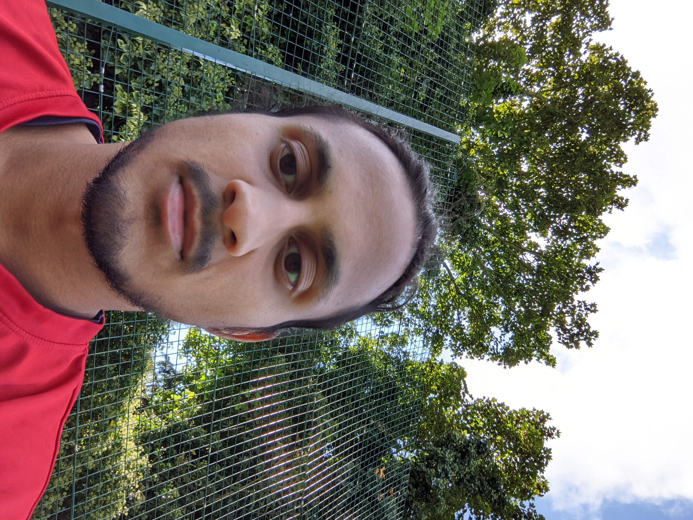

    

        
    

    

           
        Avish Vijayaraghavan 
        
PhD Candidate in AI for Healthcare

        
Imperial College London

    

Hi, I'm Avish! I'm currently studying towards a PhD in AI for Healthcare as part of the 3rd cohort for the [AI4Health CDT](https://ai4health.io/) at Imperial College London. My main PhD project is looking at interpretable, multimodal learning for idiopathic pulmonary fibrosis, supervised by [Joram M. Posma](https://www.imperial.ac.uk/people/j.posma11) and [Phil Molyneaux](https://www.imperial.ac.uk/people/p.molyneaux). Before this, I did a bachelor's in maths and computer science at Imperial and a master's in precision medicine at UCL. 

My overall aim is to push the field of precision medicine forward using machine learning. One of my key aims in *translatability* - I want to figure out how we can deploy these biomedical machine learning models to a clinical setting. To this end, I'm also interested in the broader ecosystem of UK healthcare: the NHS (and its various incarnations), healthcare and genomics policy, and ultimately how we can deliver precision medicine through the NHS.

Outside of all of that, I'm a big music and film fan - my Letterboxd (currently missing an icon) is in the footer next to the YouTube icon. I'm always interested in chatting about work, UK politics, or music/films - get in contact with me via email or Twitter below!

<!---
bundle exec jekyll serve -w --baseurl=""
git add . && git commit -m "[...]" && git push origin master && rake
-->

